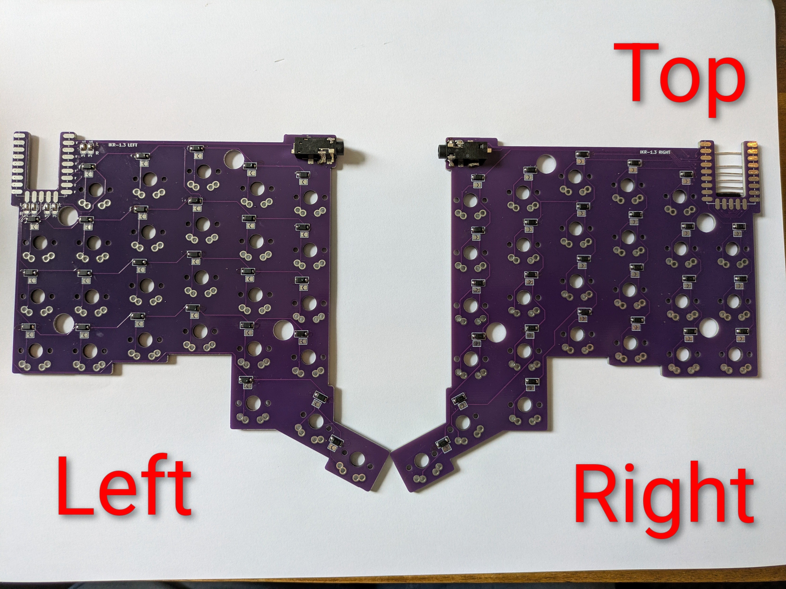
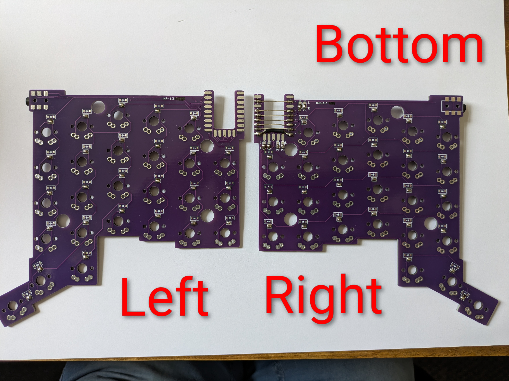

My modifications to the ik1.2 keyboard of Ian Maclarty [Github Ian Maclarty](https://github.com/ianmaclarty/ik)

# General
## Parts
- SMD headphone jack: To connect both keyboard parts I used PJ328 as headbphone sockets, because I had some of them laying around. The housing is a little bit different, but thats ok if your solder precisely.

## PCB
The PCBs are modfied (not by me) to allow to use the same PCS for left and right side of the keyboard.

This requires some additional bridges on the bottom of the right hand side PCB.

## STL
To have a little more space below the PCBS for the bridges, and solder joints, I modified the bottom STLs.
- This increases the actual height of the keyboard by 1 mm.
- Increasing the gaps a little bit for easier mounting.

To have a little more space on top of the PCBS I modified the upper STLs.
- Increasing the gaps a little bit for easier mounting.

**There are only left hand STL files. They can be mirrored during slicing.**
This reduces maintenance effort.

### Kickstand
I created a minimal kickstand to slightly tilt the keyboard.
This allows to lift the inner part of the keyboard about 12 mm which is a bit more ergonomic in my opinion.


## Keymaps
I changed the keymaps to fit my need.
The regarding files are located in **keymaps**.

For building firmware it is necessary to follow these steps:
1) clone the qmk firmware repository from [Ian Maclarty QMK](https://github.com/ianmaclarty/qmk_firmware.git).

2) Then copy the direcoty of the desired keymap (matsch) to the directory: qmk_firmware/keyboards/handwired/ianmaclarty/ik1_2/keymaps/

3) Execute the following commands
```
cd qmk_firmware
qmk setup
qmk compile -kb handwired/ianmaclarty/ik1_2 -km matsch
```

# Building
Here you find images of the PCBs after soldering diodes and bridges:

Top:


Bottom:

